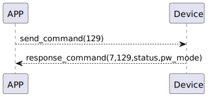

# KeyboardPassword Mode Get 説明
アプリが129コマンドを送信して、ssm_touchの現在の数字ロックの状態を取得します。

### 送信フォーマット

|  バイト  |       0 |
|:------:|-------:|
| データ   |  コマンド |

- コマンド: 指令129（固定）

### 受信フォーマット

| バイト  |    3    | 2   |     1     |     0      |
|:---:|:-------:|:------:|:----:|:---------:|
| データ | 数字ロックモード | ステータス | コマンド |レスポンス   |
- コマンド: 指令129（固定）
- レスポンス: 応答0x07（固定）
  - ステータス: 0x00（成功）
  - 数字ロックモード: 0x00->認証モード，0x01->新規追加モード

### シーケンス図


### Androidの例
```java
  override fun keyBoardPassCodeModeGet(result: CHResult<Byte>) {
        if (checkBle(result)) return
        sendCommand(SesameOS3Payload(SesameItemCode.SSM_OS3_PASSCODE_MODE_GET.value, byteArrayOf())) { res ->
            result.invoke(Result.success(CHResultState.CHResultStateBLE(res.payload[0])))
        }
    }
