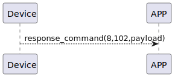

# Publish Sesame Key 讲解

ssm_touch 主动推送信息给APP

### 推送格式

| Byte  |   N~ 2   |   1   |     0      |
|:---:|:--------:|:----:|:-----:|
| Data | payload     | command |response   |

- command:指令102(固定)
- response:响应8(固定)
- payload:见 playload.

##### **payload如下**

|Byte	|68	|67 ~ 46	|45|	44 ~ 23	|22	|21 ~ 0|
|:---:|:---:|:---:|:---:|:---:|:---:|:---:|
|Data|	ssm2_status	|ssm2_name|	ssm1_status	|ssm1_name	|ssm0_status|	ssm0_name|

### 循序图



## android示例

``` java
  override fun onGattSesamePublish(receivePayload: SSM3PublishPayload) {
        super.onGattSesamePublish(receivePayload)
           if (receivePayload.cmdItCode == SesameItemCode.PUB_KEY_SESAME.value) {
//            L.d("hcia", "[ds][PUB][KEY]===>:" + receivePayload.payload.toHexString())
            ssm2KeysMap.clear()
            val keyDatas = receivePayload.payload.divideArray(23)
            keyDatas.forEach {
                val lock_status = it[22].toInt()
//                L.d("hcia", "lock_status:" + lock_status)
                if (lock_status != 0) {
//                    L.d("hcia", "it[21].toInt():" + it[21].toInt())
                    if (it[21].toInt() == 0x00) {
                        val ss5_id = it.sliceArray(IntRange(0, 15))
                        val ssmID = ss5_id.toHexString().noHashtoUUID().toString()
                        ssm2KeysMap.put(ssmID, byteArrayOf(0x05, it[22]))
                    } else {
                        val ss2_ir_22 = it.sliceArray(IntRange(0, 21))
                        try {
                            val ssmID = (String(ss2_ir_22) + "==").base64decodeHex().noHashtoUUID().toString()
                            ssm2KeysMap.put(ssmID, byteArrayOf(0x04, it[22]))
                        } catch (e: Exception) {
                            L.d("hcia", "🩰  e:" + e)
                        }
                    }
                }
            }
            L.d("hcia", "[TPO][ssm2KeysMap]" + ssm2KeysMap)
            (delegate as? CHSesameTouchProDelegate)?.onSSM2KeysChanged(this, ssm2KeysMap)
        }
        }
 
```
  

