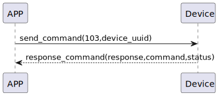

# Remove Sesame 説明
app は命令103を送信し、Sesameを削除します。
### 送信フォーマット

|  Byte  |          16~1 |       0 |
|:------:|--------------:|--------:|
| Data   |  device_uuid	 | command |

- command:命令103(固定)
- device_uuid:デバイスの唯一の識別子UUID


### 受信フォーマット

| Byte  |    2 |   1   |     0      |  
|:---:|:----:|:----:|:-----:|
| Data |  status  | command |response   |
- command:命令103(固定)
- response:応答0x07(固定)
- status:状態0x00(成功)  


### フローチャート



### android例
``` java
  override fun removeSesame(tag: String, result: CHResult<CHEmpty>) {
        if (checkBle(result)) return
        if (ssm2KeysMap.get(tag)!!.get(0).toInt() == 0x04) {// ss4
            val noDashUUID = tag.replace("-", "")
            val b64k = noDashUUID.hexStringToByteArray().base64Encode().replace("=", "")
            val ssmIRData = b64k.toByteArray()
            sendCommand(SesameOS3Payload(SesameItemCode.REMOVE_SESAME.value, ssmIRData)) { ssm2ResponsePayload ->
                result.invoke(Result.success(CHResultState.CHResultStateBLE(CHEmpty())))
            }
        } else {//ss5
            val noDashUUID = tag.replace("-", "")
            sendCommand(SesameOS3Payload(SesameItemCode.REMOVE_SESAME.value, noDashUUID.hexStringToByteArray())) { ssm2ResponsePayload ->
                result.invoke(Result.success(CHResultState.CHResultStateBLE(CHEmpty())))
            }
        }
    }
```
