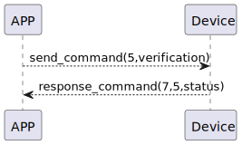

#  connectWifi 讲解

### 发送格式

|  Byte  |     16~1 |       0 |
|:------:|---------:|--------:|
| Data   | verification	 | command |

- command:指令5(固定)
- verification:校验deviceId
### 接收格式
| Byte  |    2 |   1   |     0      |
|:---:|:----:|:----:|:-----:|
| Data |  status  | command |response   |
- command:指令5(固定)
- response:响应0x07(固定)
- status:状态0x00(成功)

### 循序图



### android示例
``` java
  override fun connectWifi(result: CHResult<CHEmpty>) {
        val company = CHConfiguration.CLIENT_ID!!.replace(":", "").replace("-", "")
        //        L.d("hcia", "company.toByteArray():" + company.toByteArray().toHexString())
        val verification = company + ":" + deviceId.toString().uppercase().split('-').last()
        sendCommand(SesameOS3Payload(WM2ActionCode.CONNECT_WIFI.value, verification.toByteArray())) { res ->
            if (res.cmdResultCode == SesameResultCode.success.value) {
                result.invoke(Result.success(CHResultState.CHResultStateBLE(CHEmpty())))
            } else {
                result.invoke(Result.failure(CHError.NotfoundError.value))
            }
        }
    }
```
