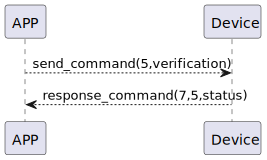

# connectWifi 説明

### 送信フォーマット

|  バイト  |     16~1 |       0 |
|:------:|---------:|--------:|
| データ   | デバイスID検証	 | コマンド |

- コマンド: 指令5（固定）
- デバイスID検証: デバイスIDの検証

### 受信フォーマット
| バイト  |    2 |   1   |     0      |
|:---:|:----:|:----:|:-----:|
| データ | ステータス  | コマンド |レスポンス   |
- コマンド: 指令5（固定）
- レスポンス: 応答0x07（固定）
- ステータス: 状態0x00（成功）

### シーケンス図


### Androidの例
```java
  override fun connectWifi(result: CHResult<CHEmpty>) {
        val company = CHConfiguration.CLIENT_ID!!.replace(":", "").replace("-", "")
        //        L.d("hcia", "company.toByteArray():" + company.toByteArray().toHexString())
        val verification = company + ":" + deviceId.toString().uppercase().split('-').last()
        sendCommand(SesameOS3Payload(WM2ActionCode.CONNECT_WIFI.value, verification.toByteArray())) { res ->
            if (res.cmdResultCode == SesameResultCode.success.value) {
                result.invoke(Result.success(CHResultState.CHResultStateBLE(CHEmpty())))
            } else {
                result.invoke(Result.failure(CHError.NotfoundError.value))
            }
        }
    }
