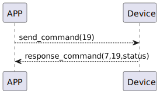

# setWifiPassword 説明

### 送信フォーマット

|  バイト  |      N~1 |       0 |
|:------:|---------:|--------:|
| データ   | SSIDとパスワード	 | コマンド |

- コマンド: 指令4（固定）
- SSIDとパスワード: SSIDとパスワード

### 受信フォーマット
| バイト  |    2 |   1   |     0      |
|:---:|:----:|:----:|:-----:|
| データ | ステータス  | コマンド |レスポンス   |
- コマンド: 指令4（固定）
- レスポンス: 応答0x07（固定）
- ステータス: 状態0x00（成功）

### シーケンス図


### Androidの例
```java
       override fun setWifiPassword(password: String, result: CHResult<CHEmpty>) {
        sendCommand(SesameOS3Payload(WM2ActionCode.UPDATE_WIFI_PASSWORD.value, password.toByteArray())) { res ->
            if (res.cmdResultCode == SesameResultCode.success.value) { //                L.d("hcia", "設定密碼完畢:" + String(res.payload))
                result.invoke(Result.success(CHResultState.CHResultStateBLE(CHEmpty())))
            }
        }
    }
